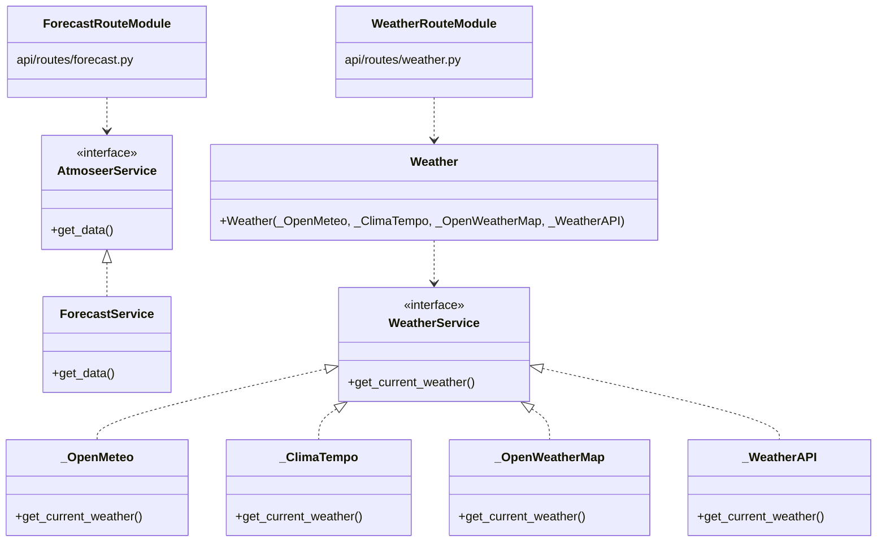
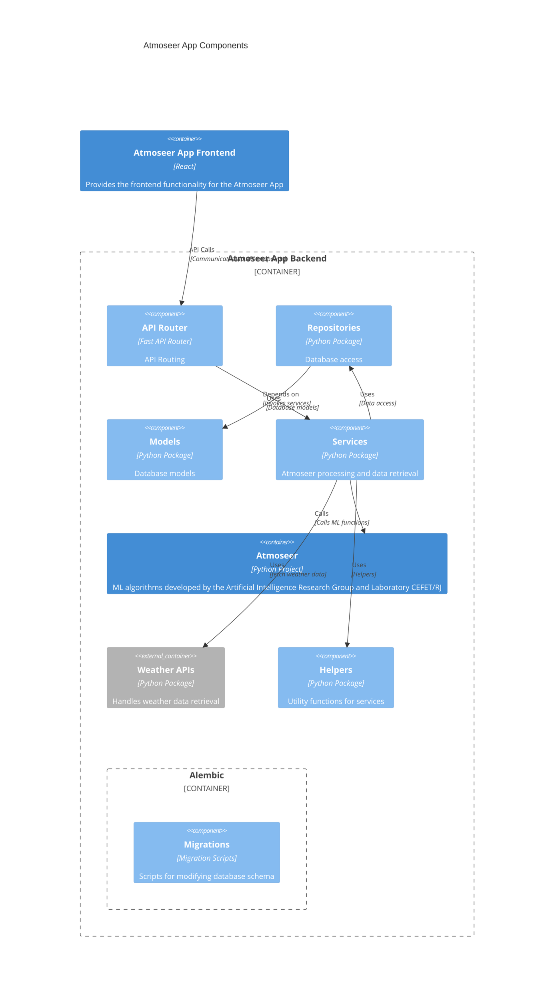

# Atmoseer app backend

This project is powered by [FastAPI](https://github.com/tiangolo/fastapi) and developed using [Python 3.12](https://www.python.org/downloads/release/python-3123/).

## Get Started

Clone the repository
```sh
git clone https://github.com/NietoCurcio/atmoseer-app-backend.git
cd atmoseer-app-backend
```

Initialize [atmoseer](https://github.com/MLRG-CEFET-RJ/atmoseer) [submodule](https://git-scm.com/book/en/v2/Git-Tools-Submodules)
```sh
git submodule update --init --progress
```

### Setup with poetry (recommended)

Install [poetry](https://github.com/python-poetry/poetry) dependency manager.
  - Linux and macOS
    ```sh
    curl -sSL https://install.python-poetry.org | python3 -
    ```

  - Windows Powershell
    ```sh
    (Invoke-WebRequest -Uri https://install.python-poetry.org -UseBasicParsing).Content | python -
    ```

Install project dependencies. A virtual environment in [`{cache-dir}/virtualenvs`](https://python-poetry.org/docs/configuration/#cache-dir) is automatically created by poetry:
```sh
poetry install

# Creating virtualenv atmoseer-app-backend-...
# Installing dependencies from lock file
# ...
# Installing the current project: atmoseer-app-backend (0.1.0)
```

### Setup with python venv or virtualenv (optional)

It's also possible to install the application with `pip` using [poetry build backend](https://python-poetry.org/docs/pyproject/#poetry-and-pep-517), please see [Writing your pyproject.toml](https://packaging.python.org/en/latest/guides/writing-pyproject-toml/#writing-your-pyproject-toml). Setup the application using the python [venv standard library](https://docs.python.org/3/library/venv.html) or [virtualenv tool](https://virtualenv.pypa.io/en/latest/index.html):
```sh
python -m venv .venv
source .venv/bin/activate # use ".venv\Scripts\activate.ps1" in Windows Powershell
pip install -e .
# You can execute "deactivate" to deactivate the virtual environment
```

### Setup with conda (optional)

TODO

Start a local instance of PostgreSQL with [Docker](https://hub.docker.com/_/postgres):
```sh
docker compose up
# pg-admin is running at http://localhost:5050
```

## Running the application

Note, if you setup the application without poetry, just run the commands without `poetry run`. For example, for the alembic command below it should be `alembic upgrade head` since the CLIs are installed in the activated virtual environment. Since poetry also creates a virtual environment, it's also possible to run commands directly (without `poetry run`) with poetry by running `poetry shell` to create a nested shell (enter `exit` to deactivate and exit), please see [using your virtual environment](https://python-poetry.org/docs/basic-usage/#using-your-virtual-environment)

Run [alembic](https://alembic.sqlalchemy.org/en/latest/tutorial.html) database migrations:
```sh
poetry run alembic upgrade head

# INFO  [alembic.runtime.migration] Context impl PostgresqlImpl.
# INFO  [alembic.runtime.migration] Will assume transactional DDL.
# INFO  [alembic.runtime.migration] Running upgrade  -> 76213b2e56df, create hero table

# to undo all migrations run 'poetry run alembic downgrade base'
```

Start the server:

- Using Poetry:
    ```sh
    poetry run start
    # INFO:     Uvicorn running on http://127.0.0.1:3333 (Press CTRL+C to quit)
    # ...
    # INFO:     Application startup complete.
    ```
- Using a virtual environment:
    ```sh
    python -m atmoseer_app_backend.main
    ```


Documentation

- Interactive API docs http://localhost:3333/docs
- Alternative API docs http://localhost:3333/redoc

## Project structure

```
atmoseer-app-backend/
├── README.md
├── alembic.ini
├── docker-compose.yml
├── poetry.lock
├── pyproject.toml
└── atmoseer_app_backend/
    ├── app.py
    ├── config.py
    ├── main.py
    ├── api/
    │   ├── router.py
    │   └── routes/
    │       ├── forecast.py
    │       ├── heros.py
    │       └── weather.py
    ├── helpers/
    │   ├── AsyncExecutor.py
    │   ├── GeoStationReader.py
    │   ├── GeoStations.py
    │   ├── GreatCircleDistance.py
    │   ├── Logger.py
    │   ├── WeatherStations.csv
    │   └── models/
    │       └── Station.py
    ├── migrations/
    │   └── alembic/
    │       ├── README
    │       ├── env.py
    │       ├── script.py.mako
    │       └── versions/
    │           └── 76213b2e56df_create_hero_table.py
    ├── models/
    │   └── Hero.py
    ├── repositories/
    │   ├── HeroRepository.py
    │   ├── database/
    │   │   └── database.py
    │   └── interfaces/
    │       └── Repository.py
    └── services/
        ├── ForecastService.py
        ├── HeroService.py
        ├── exceptions/
        │   ├── BaseHTTPException.py
        │   └── exceptions.py
        ├── interfaces/
        │   ├── AtmoseerService.py
        │   └── Service.py
        └── weather/
            ├── Weather.py
            ├── _ClimaTempo.py
            ├── _OpenMeteo.py
            ├── _OpenWeatherMap.py
            ├── _WeatherAPI.py
            ├── interfaces/
            │   └── WeatherService.py
            └── models/
                └── Weather.py
```

The source code of the backend is in the `atmoseer_app_backend` folder. The `atmoseer` folder is a submodule, it has its own git repostiory at [NietoCurcio/atmoseer Github](https://github.com/NietoCurcio/atmoseer). The `atmoseer` submodule is necessary to use the machine learning algorithms developed by the CEFET-RJ Machine Learning Research Group.

- Endpoints

`/forecast`

`/weather` and `/weather/services`

- Services

`ForecastService`

`WeatherService`

### Class diagram



### Component diagram



## Technologies

### Docker

Removing all containers:
```sh
docker rm -f $(docker ps -a -q)
```

Removing all volumes:
```sh
docker volume rm $(docker volume ls -q)
```

### Ruff

[Ruff](https://github.com/astral-sh/ruff) linter and code formatter. Ruff is used by major projects like pandas, Jupyter, PyTorch, SciPy etc.

Run ruff linter:
```sh
poetry run ruff check atmoseer_app_backend --fix 
```

Run ruff formatter:
```sh
poetry run ruff format atmoseer_app_backend
```

We can use [Ruff vscode extension](https://github.com/astral-sh/ruff-vscode). After installing the extension, we can configure Ruff extension to lint and format code on vscode settings.json.
```json
{
  "[python]": {
    "editor.formatOnSave": true,
    "editor.codeActionsOnSave": {
      "source.fixAll": "explicit"
    },
    "editor.defaultFormatter": "charliermarsh.ruff"
  }
}
```

## Related video

Video presenting the Atmoseer app backend execution and the main functionalities:

[](https://www.youtube.com/watch?v=y0nrW35oIyU)